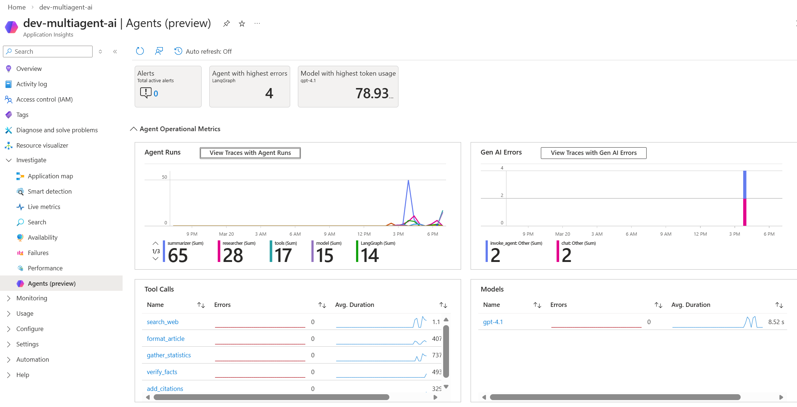
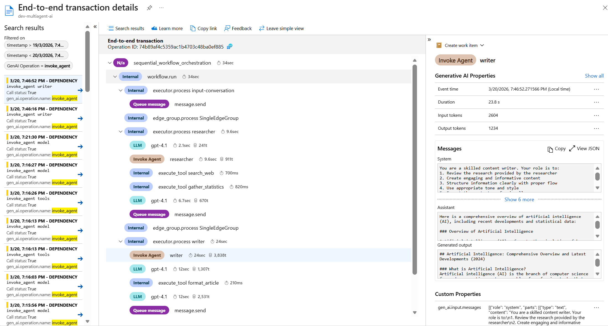

# AI Agent Observability with OpenTelemetry and Azure Application Insights

> **Comprehensive guide for instrumenting single and multi-agent systems using LangChain, LangGraph, and Microsoft Agent Framework with OpenTelemetry semantic conventions**

## Table of Contents

- [Overview](#overview)
- [OpenTelemetry GenAI Semantic Conventions](#opentelemetry-genai-semantic-conventions)
- [Prerequisites](#prerequisites)
- [Quick Start](#quick-start)
- [Framework-Specific Guides](#framework-specific-guides)
  - [Microsoft Agent Framework](#microsoft-agent-framework)
  - [LangChain and LangGraph](#langchain-and-langgraph)
- [Single Agent Tracing](#single-agent-tracing)
- [Multi-Agent Tracing](#multi-agent-tracing)
- [Best Practices](#best-practices)
- [Troubleshooting](#troubleshooting)
- [Viewing Traces in Azure Monitor](#viewing-traces-in-azure-monitor)
- [Sample Files Reference](#sample-files-reference)
- [Additional Resources](#additional-resources)

---

## Overview

This guide demonstrates how to instrument AI agents with **OpenTelemetry** for comprehensive observability in **Azure Application Insights**. Microsoft has contributed to enriching GenAI semantic conventions in OpenTelemetry, enabling unified multi-agent observability across different frameworks.

> **Important**: This guide focuses on **currently implemented** observability features. Some advanced spans (like `agent_to_agent_interaction`, `agent_orchestration`) are proposed in the OpenTelemetry specification but not yet widely available in SDK versions. See the [OpenTelemetry GenAI Semantic Conventions](#opentelemetry-genai-semantic-conventions) section for details on what's currently implemented vs. proposed.

### What You'll Learn

- How to configure tracing for single and multi-agent systems
- Best practices for instrumentation across different agent frameworks
- How to create unified traces across multiple agents
- Debugging and optimization techniques using Application Insights

### Key Benefits

1. **Unified Observability**: Monitor agents built with different frameworks in one place
2. **End-to-End Visibility**: Track user requests through agent collaboration, tool usage, and final output
3. **Faster Debugging**: Trace exact execution paths to identify failures
4. **Quality & Safety**: Built-in metrics for monitoring performance and safety
5. **Cost Optimization**: Detailed token usage and resource consumption tracking

---

## OpenTelemetry GenAI Semantic Conventions

Microsoft has contributed to enriching [OpenTelemetry Semantic Conventions for GenAI](https://opentelemetry.io/docs/specs/semconv/gen-ai/gen-ai-agent-spans/) to capture the complexity of multi-agent systems. The specification includes both **currently implemented** spans/attributes and **proposed future additions**.

### Currently Implemented Spans and Attributes

These are **actively emitted** by the current SDKs and visible in traces:

| Type | Name | Purpose | Emitted By |
|------|------|---------|------------|
| **Span** | `invoke_agent` | Captures agent execution | Agent Framework, LangChain, LangGraph |
| **Span** | `chat` / `LLM` | Records LLM calls | All frameworks |
| **Span** | `execute_tool` | Logs tool invocations | All frameworks |
| **Span** | `workflow.run` | Captures workflow orchestration | Agent Framework |
| **Attribute** | `gen_ai.agent.name` | Agent identifier | `invoke_agent` spans |
| **Attribute** | `gen_ai.system` | LLM provider | `chat` spans |
| **Attribute** | `gen_ai.request.model` | Model requested | `chat` spans |
| **Attribute** | `gen_ai.response.model` | Actual model version | `chat` spans |
| **Attribute** | `gen_ai.usage.prompt_tokens` | Input tokens | `chat` spans |
| **Attribute** | `gen_ai.usage.completion_tokens` | Output tokens | `chat` spans |
| **Attribute** | `gen_ai.tool.name` | Tool identifier | `execute_tool` spans |
| **Attribute** | `tool.call.id` | Tool invocation ID | `execute_tool` spans |
| **Attribute** | `tool.call.arguments` | Tool arguments (JSON) | `execute_tool` spans |
| **Attribute** | `tool.call.results` | Tool results | `execute_tool` spans |

> **Recently Added to Spec** (September 2025): `gen_ai.tool_definitions` attribute was merged into the OpenTelemetry specification via [PR #2702](https://github.com/open-telemetry/semantic-conventions/pull/2702), which adds tool descriptions to `invoke_agent` and inference spans. SDK implementations are in progress.

### Proposed Future Additions

These have been **proposed** to OpenTelemetry but are **not yet** widely implemented in current SDK versions:

| Addition | Name | Purpose | Status |
|----------|------|---------|--------|
| **Span** | `execute_task` | Captures task planning and event propagation | Proposed (not in spec) |
| **Span** | `agent_to_agent_interaction` | Traces communication between agents | Proposed (not in spec) |
| **Span** | `agent.state.management` | Manages context and memory | Proposed (not in spec) |
| **Span** | `agent_planning` | Logs internal planning steps | Proposed (not in spec) |
| **Span** | `agent_orchestration` | Captures agent-to-agent orchestration | Proposed (not in spec) |

> **Note**: PR [#2702](https://github.com/open-telemetry/semantic-conventions/pull/2702) (merged Sept 2025) added tool-related attributes (`tool_definitions`, `tool.call.arguments`, `tool.call.result`) to the spec, and these are being implemented in SDKs. However, the new span types above are still proposals and not yet part of the specification.

### References

- [Azure AI Foundry: Advancing OpenTelemetry](https://techcommunity.microsoft.com/blog/azure-ai-foundry-blog/azure-ai-foundry-advancing-opentelemetry-and-delivering-unified-multi-agent-obse/4456039)
- [OpenTelemetry GenAI Agent Spans Spec](https://opentelemetry.io/docs/specs/semconv/gen-ai/gen-ai-agent-spans/)

---

## Prerequisites

### Azure Resources

1. **Azure AI Foundry Project** with [tracing connected](https://learn.microsoft.com/en-us/azure/foundry/observability/how-to/trace-agent-setup) to Application Insights
2. **Application Insights** resource (connection string required)
3. **Azure OpenAI** resource with chat model deployment
4. **Appropriate RBAC roles**:
   - Contributor or higher on Application Insights (for trace ingestion)
   - Log Analytics Reader (for viewing traces)

### Environment

- Python 3.10 or later
- Virtual environment (recommended)
- Azure credentials configured (`DefaultAzureCredential`)

### Required Packages

#### For Microsoft Agent Framework
```bash
pip install azure-ai-agent azure-monitor-opentelemetry
```

#### For LangChain/LangGraph
```bash
pip install \
  langchain-azure-ai[opentelemetry] \
  langchain>=1.0.0 \
  langgraph>=1.0.0 \
  langchain-openai \
  azure-identity \
  python-dotenv
```

### Environment Variables

Create a `.env` file in your project root:

```bash
# Application Insights (Required)
APPLICATION_INSIGHTS_CONNECTION_STRING=InstrumentationKey=...

# Azure OpenAI (Required)
AZURE_OPENAI_ENDPOINT=https://<your-resource>.openai.azure.com/
AZURE_OPENAI_CHAT_DEPLOYMENT=<your-deployment-name>
AZURE_OPENAI_VERSION=2024-08-01-preview

# Optional (for Agent Framework)
AZURE_AI_PROJECT_ENDPOINT=https://<your-project>.api.azure.com
```

---

## Quick Start

### Option 1: LangChain/LangGraph (Recommended for Quick Start)

```python
from dotenv import load_dotenv
import os
from langchain_azure_ai.callbacks.tracers import AzureAIOpenTelemetryTracer
from langchain_openai import AzureChatOpenAI
from azure.identity import get_bearer_token_provider, DefaultAzureCredential

load_dotenv()

# CRITICAL: Initialize tracer at module level (not inside function)
azure_tracer = AzureAIOpenTelemetryTracer(
    connection_string=os.environ["APPLICATION_INSIGHTS_CONNECTION_STRING"],
    enable_content_recording=True,  # Set False in production
    trace_all_langgraph_nodes=True,  # REQUIRED for LangGraph
)

# Configure Azure OpenAI
token_provider = get_bearer_token_provider(
    DefaultAzureCredential(),
    "https://ai.azure.com/.default"
)

llm = AzureChatOpenAI(
    azure_endpoint=os.environ["AZURE_OPENAI_ENDPOINT"],
    azure_deployment=os.environ["AZURE_OPENAI_CHAT_DEPLOYMENT"],
    api_version=os.environ["AZURE_OPENAI_VERSION"],
    azure_ad_token_provider=token_provider,
)

# Use with agent
config = {"callbacks": [azure_tracer]}
result = agent.invoke({"messages": [...]}, config=config)
```

### Option 2: Microsoft Agent Framework

#### Using configure_otel_providers (Simplest)

```python
from agent_framework.observability import configure_otel_providers
from agent_framework import Agent
import os

# Configure everything from environment variables
configure_otel_providers()

# Create and run agent - traces automatically captured
agent = Agent(
    model=os.environ["AZURE_OPENAI_CHAT_DEPLOYMENT"],
    instructions="You are a helpful assistant.",
)

result = agent.run(user_input="Hello!")
```

Required environment variables:
```bash
APPLICATION_INSIGHTS_CONNECTION_STRING=InstrumentationKey=...
ENABLE_INSTRUMENTATION=true
OTEL_SERVICE_NAME=my-agent
```

#### Using AIProjectClient (For Azure AI Projects)

```python
from azure.ai.projects.aio import AIProjectClient
from agent_framework.azure import AzureAIClient

async with (
    AIProjectClient.from_connection_string(...) as project_client,
    AzureAIClient(project_client=project_client) as client,
):
    # Automatically configures Azure Monitor
    await client.configure_azure_monitor(enable_live_metrics=True)
    
    # Your agent code here
    agent = client.create_agent(...)
```

---

## Framework-Specific Guides

### Microsoft Agent Framework

Microsoft Agent Framework has **native integration** with Azure AI Foundry. Agents automatically emit traces when tracing is enabled—no additional code required.

#### Pattern 1: configure_otel_providers (Recommended)

The `configure_otel_providers()` function is the **recommended approach** for Agent Framework. It automatically:
- Reads standard OpenTelemetry environment variables
- Configures trace, log, and metric exporters
- Sets up providers with proper resource attributes
- Enables Agent Framework instrumentation

##### Option A: With Environment Variables (Simplest)

```bash
# .env file
# For Application Insights
APPLICATION_INSIGHTS_CONNECTION_STRING=InstrumentationKey=...

# Standard OpenTelemetry settings
OTEL_SERVICE_NAME=my-agent-service
OTEL_SERVICE_VERSION=1.0.0
ENABLE_INSTRUMENTATION=true
ENABLE_SENSITIVE_DATA=false  # Only true in dev/test
```

```python
from agent_framework.observability import configure_otel_providers

# Automatically reads env vars and configures everything
configure_otel_providers()

# Your agent code here
agent = Agent(...)
```

##### Option B: With Connection String (Programmatic)

```python
import os
from agent_framework.observability import configure_otel_providers
from azure.monitor.opentelemetry.exporter import AzureMonitorTraceExporter, AzureMonitorLogExporter, AzureMonitorMetricExporter

# Create Azure Monitor exporters
conn_str = os.environ["APPLICATION_INSIGHTS_CONNECTION_STRING"]
exporters = [
    AzureMonitorTraceExporter.from_connection_string(conn_str),
    AzureMonitorLogExporter.from_connection_string(conn_str),
    AzureMonitorMetricExporter.from_connection_string(conn_str),
]

# Configure with custom exporters
configure_otel_providers(
    exporters=exporters,
    enable_sensitive_data=False,  # Set True only in dev
)
```

##### Option C: With OTLP Endpoint (For Aspire Dashboard, Jaeger, etc.)

```bash
# .env file
OTEL_EXPORTER_OTLP_ENDPOINT=http://localhost:4317
OTEL_EXPORTER_OTLP_PROTOCOL=grpc  # or 'http'
OTEL_SERVICE_NAME=my-agent-service
ENABLE_INSTRUMENTATION=true
```

```python
from agent_framework.observability import configure_otel_providers

# Automatically configures OTLP exporters from env vars
configure_otel_providers()
```

##### Option D: Console Output (For Local Development)

```python
from agent_framework.observability import configure_otel_providers

# Enable console exporters for debugging
configure_otel_providers(enable_console_exporters=True)
```

**Key Points**:
- `configure_otel_providers()` handles **both** exporter setup **and** instrumentation
- Supports multiple exporter types simultaneously (Azure Monitor + OTLP + Console)
- Uses standard OpenTelemetry environment variables for portability
- No need to call `enable_instrumentation()` separately

#### Pattern 2: Using AIProjectClient (For Azure AI Projects)

```python
from azure.ai.projects.aio import AIProjectClient
from agent_framework.azure import AzureAIClient

async with (
    AIProjectClient.from_connection_string(
        conn_str=os.environ["AZURE_AI_PROJECT_CONNECTION_STRING"]
    ) as project_client,
    AzureAIClient(project_client=project_client) as client,
):
    # This configures Azure Monitor + enables instrumentation
    await client.configure_azure_monitor(enable_live_metrics=True)
    
    # Create and run agent
    agent = client.create_agent(
        model=os.environ["AZURE_OPENAI_CHAT_DEPLOYMENT"],
        instructions="You are a helpful assistant.",
    )
    
    result = await agent.run(user_input="Hello!")
```

**When to use**: When working with Azure AI Projects/Foundry SDK

#### Pattern 3: Third-Party Setup + enable_instrumentation

For third-party observability platforms (LangFuse, Comet Opik, etc.) that provide their own setup:

```python
from azure.monitor.opentelemetry import configure_azure_monitor
from agent_framework.observability import create_resource, enable_instrumentation

# Configure Azure Monitor manually
configure_azure_monitor(
    connection_string=os.environ["APPLICATION_INSIGHTS_CONNECTION_STRING"],
    resource=create_resource(),  # Uses OTEL_SERVICE_NAME
    enable_live_metrics=True,
)

# Enable Agent Framework instrumentation
enable_instrumentation(enable_sensitive_data=False)
```

**When to use**: When you need manual control over provider configuration or using third-party platforms

**Note**: If using `configure_azure_monitor()` or similar third-party setup, you must call `enable_instrumentation()` separately to activate Agent Framework's telemetry code paths.

#### Multi-Agent Workflows with SequentialBuilder

```python
from agent_framework import SequentialBuilder

workflow = SequentialBuilder()
workflow.add_agent(researcher_agent, name="Researcher")
workflow.add_agent(writer_agent, name="Writer")

# Traces are automatically created with proper hierarchy
result = await workflow.run(user_input="Research quantum computing")
```

**See**: [`sequential_workflow_maf.py`](./sequential_workflow_maf.py) for complete example.

---

### LangChain and LangGraph

LangChain and LangGraph use the `langchain-azure-ai` package for tracing via callbacks.

#### Key Requirements

1. **Module-level tracer initialization** (not inside functions)
2. **`trace_all_langgraph_nodes=True`** for LangGraph support
3. **Pass tracer via `config` parameter** in `invoke()`

#### Single Agent with LangChain

```python
from dotenv import load_dotenv
import os
from langchain_azure_ai.callbacks.tracers import AzureAIOpenTelemetryTracer
from langchain.agents import create_agent
from langchain_openai import AzureChatOpenAI
from azure.identity import get_bearer_token_provider, DefaultAzureCredential
from langchain_core.tools import tool

load_dotenv()

# CRITICAL: Initialize at module level
azure_tracer = AzureAIOpenTelemetryTracer(
    connection_string=os.environ["APPLICATION_INSIGHTS_CONNECTION_STRING"],
    enable_content_recording=True,
    name="My Agent",
)

# Define tools
@tool
def search_web(query: str) -> str:
    """Search the web for information."""
    return f"Search results for: {query}"

# Configure LLM
token_provider = get_bearer_token_provider(
    DefaultAzureCredential(),
    "https://ai.azure.com/.default"
)

llm = AzureChatOpenAI(
    azure_endpoint=os.environ["AZURE_OPENAI_ENDPOINT"],
    azure_deployment=os.environ["AZURE_OPENAI_CHAT_DEPLOYMENT"],
    api_version=os.environ["AZURE_OPENAI_VERSION"],
    azure_ad_token_provider=token_provider,
)

# Create agent
agent = create_agent(
    model=llm,
    prompt="You are a helpful research assistant.",
    tools=[search_web],
)

# Run with tracing
config = {"callbacks": [azure_tracer]}
result = agent.invoke(
    {"messages": [{"role": "user", "content": "Research AI trends"}]},
    config=config
)
```

**See**: [`langchain_single_agent_tracing.py`](./langchain_single_agent_tracing.py) for complete example.

#### Multi-Agent with LangGraph

```python
from langgraph.graph import StateGraph, MessagesState, END, START
from langgraph.prebuilt import ToolNode
from langchain_azure_ai.callbacks.tracers import AzureAIOpenTelemetryTracer
import os

# Module-level tracer with LangGraph support
azure_tracer = AzureAIOpenTelemetryTracer(
    connection_string=os.environ["APPLICATION_INSIGHTS_CONNECTION_STRING"],
    enable_content_recording=True,
    trace_all_langgraph_nodes=True,  # CRITICAL for LangGraph
)

# Define tools
research_tools = [search_web, gather_statistics]
writing_tools = [format_article, add_citations]

# Create graph
def create_workflow():
    workflow = StateGraph(MessagesState)
    
    # Add nodes
    workflow.add_node("researcher", create_researcher_node(llm, research_tools))
    workflow.add_node("researcher_tools", ToolNode(research_tools))
    workflow.add_node("writer", create_writer_node(llm, writing_tools))
    workflow.add_node("writer_tools", ToolNode(writing_tools))
    
    # Add edges with conditional routing
    workflow.add_edge(START, "researcher")
    workflow.add_conditional_edges("researcher", should_continue_research)
    workflow.add_edge("researcher_tools", "researcher")
    workflow.add_edge("researcher", "writer")
    workflow.add_conditional_edges("writer", should_continue_writing)
    workflow.add_edge("writer_tools", "writer")
    workflow.add_edge("writer", END)
    
    return workflow.compile()

# Run with tracing
app = create_workflow()
config = {"callbacks": [azure_tracer]}
result = app.invoke({"messages": [...]}, config=config)
```

**See**: [`multi_agent_workflow_langraph.py`](./multi_agent_workflow_langraph.py) for complete example.

---

## Single Agent Tracing

### Expected Trace Hierarchy

Based on the current SDK implementations, you'll see these spans in your traces:

```
invoke_agent <agent_name>
├── chat / LLM (model: gpt-4)
│   ├── gen_ai.system = "openai"
│   ├── gen_ai.request.model = "gpt-4"
│   ├── gen_ai.response.model = "gpt-4-0613"
│   ├── gen_ai.usage.prompt_tokens = 120
│   └── gen_ai.usage.completion_tokens = 80
├── execute_tool <tool_name>
│   ├── gen_ai.tool.name = "search_web"
│   ├── tool.call.id = "call_abc123"
│   ├── tool.call.arguments = "{\"query\": \"...\"}"
│   └── tool.call.results = "..."
└── chat / LLM (final response)
```

**For Agent Framework workflows**, you may also see:
```
sequential_workflow_orchestration (or workflow name)
├── workflow.run
│   ├── executor.process <agent_name>
│   │   ├── invoke_agent <agent_name>
│   │   │   ├── LLM (gpt-4)
│   │   │   └── execute_tool <tool_name>
│   │   └── message.send
│   └── edge_group.process
```

### Configuration Checklist

- [ ] Tracer initialized at module level
- [ ] `enable_content_recording=True` in dev (False in prod)
- [ ] Callbacks passed in `config` parameter
- [ ] Connection string correctly set
- [ ] Azure credentials configured
- [ ] Tools properly decorated with `@tool`

### Samples

| File | Description |
|------|-------------|
| [`langchain_single_agent_tracing.py`](./langchain_single_agent_tracing.py) | LangChain agent with tools and context |
| [`langraph_single_agent_tracing.py`](./langraph_single_agent_tracing.py) | LangGraph agent with tool node |
| [`agent_tracing.py`](./agent_tracing.py) | Agent Framework basic tracing |

---

## Multi-Agent Tracing

### Challenge: Unified Trace IDs

By default, each agent invocation creates a separate `trace_id`. To capture all operations under a single trace:

#### Solution 1: Parent Span (LangChain/create_agent)

```python
from opentelemetry import trace

# Get OpenTelemetry tracer
otel_tracer = trace.get_tracer(__name__)

# Wrap entire workflow in parent span
with otel_tracer.start_as_current_span("Multi-Agent Workflow") as parent_span:
    parent_span.set_attribute("workflow.type", "multi_agent")
    parent_span.set_attribute("workflow.query", user_query)
    
    # Run agents sequentially
    config = {"callbacks": [azure_tracer]}
    
    research_result = researcher_agent.invoke(
        {"messages": [...]},
        config=config
    )
    
    writer_result = writer_agent.invoke(
        {"messages": [...]},
        config=config
    )
    
    # Add timing metadata
    parent_span.set_attribute("workflow.total_time", total_time)
```

#### Solution 2: LangGraph Native (Recommended)

LangGraph creates a parent span automatically when you invoke the compiled graph:

```python
# LangGraph automatically creates unified trace
app = workflow.compile()
config = {"callbacks": [azure_tracer]}

# Single trace_id for entire workflow
result = app.invoke({"messages": [...]}, config=config)
```

#### Solution 3: Agent Framework SequentialBuilder

```python
from agent_framework import SequentialBuilder

# Automatic unified tracing
workflow = SequentialBuilder()
workflow.add_agent(researcher, name="Researcher")
workflow.add_agent(writer, name="Writer")

# Single trace for entire sequence
result = await workflow.run(user_input="...")
```

### Expected Multi-Agent Trace Hierarchy

Based on current SDK implementations, here's what you'll actually see in traces:

#### LangGraph Multi-Agent Traces
```
<graph_name> (parent span - automatically created)
├── invoke_agent Researcher
│   ├── LLM / chat (gpt-4)
│   ├── execute_tool search_web
│   ├── execute_tool gather_statistics
│   └── LLM / chat (final response)
├── <conditional_edge_logic>
└── invoke_agent Writer
    ├── LLM / chat (gpt-4)
    ├── execute_tool format_article
    ├── execute_tool add_citations
    └── LLM / chat (final output)
```

#### Agent Framework SequentialBuilder Traces
```
sequential_workflow_orchestration (or custom workflow name)
├── workflow.run
│   ├── executor.process input-conversation
│   ├── message.send
│   ├── edge_group.process SingleEdgeGroup
│   ├── executor.process researcher
│   │   ├── invoke_agent researcher
│   │   │   ├── LLM (gpt-4)
│   │   │   ├── execute_tool search_web
│   │   │   ├── execute_tool gather_statistics
│   │   │   └── LLM (gpt-4)
│   │   └── message.send
│   ├── edge_group.process SingleEdgeGroup
│   └── executor.process writer
│       ├── invoke_agent writer
│       │   ├── LLM (gpt-4)
│       │   ├── execute_tool format_article
│       │   └── LLM (gpt-4)
│       └── message.send
```

> **Note**: The actual span names may vary slightly depending on framework version. Check your traces in Azure Monitor > Agents (Preview) to see the exact hierarchy for your implementation.

### Samples

| File | Description | Approach |
|------|-------------|----------|
| [`multi_agent_workflow_langchain.py`](./multi_agent_workflow_langchain.py) | LangChain agents with parent span | Manual parent span |
| [`multi_agent_workflow_langraph.py`](./multi_agent_workflow_langraph.py) | LangGraph multi-agent graph | Native LangGraph |
| [`sequential_workflow_maf.py`](./sequential_workflow_maf.py) | Agent Framework SequentialBuilder | Native Agent Framework |

---

## Best Practices

### 1. Tracer Initialization

✅ **DO**: Initialize tracer at module level
```python
# At top of file, after imports
azure_tracer = AzureAIOpenTelemetryTracer(...)
```

❌ **DON'T**: Initialize inside functions
```python
def run_agent():
    # This breaks callback propagation!
    tracer = AzureAIOpenTelemetryTracer(...)
```

### 2. Content Recording

```python
# Development/Testing
azure_tracer = AzureAIOpenTelemetryTracer(
    connection_string=...,
    enable_content_recording=True,  # See full prompts/responses
)

# Production
azure_tracer = AzureAIOpenTelemetryTracer(
    connection_string=...,
    enable_content_recording=False,  # Protect sensitive data
)
```

### 3. Connection String vs Project Endpoint

✅ **Preferred**: Use `connection_string` (avoids token calls)
```python
azure_tracer = AzureAIOpenTelemetryTracer(
    connection_string=os.environ["APPLICATION_INSIGHTS_CONNECTION_STRING"],
    ...
)
```

⚠️ **Alternative**: Use `project_endpoint` (requires managed identity)
```python
azure_tracer = AzureAIOpenTelemetryTracer(
    project_endpoint=os.environ["AZURE_AI_PROJECT_ENDPOINT"],
    credential=DefaultAzureCredential(),
    ...
)
```

### 4. LangGraph-Specific

```python
# REQUIRED for proper LangGraph tracing
azure_tracer = AzureAIOpenTelemetryTracer(
    connection_string=...,
    trace_all_langgraph_nodes=True,  # CRITICAL!
)
```

Without `trace_all_langgraph_nodes=True`, you'll see:
- Flat trace hierarchy
- "0" duration spans
- Missing intermediate nodes
- Wrong span order

### 5. Agent Framework Configuration

✅ **Recommended**: Use `configure_otel_providers()` for simplicity
```python
from agent_framework.observability import configure_otel_providers

# Automatically reads OTEL_* and APPLICATION_INSIGHTS_* env vars
configure_otel_providers()
```

**Benefits**:
- Handles exporters, providers, and instrumentation in one call
- Uses standard OpenTelemetry environment variables
- Supports multiple backends (Azure Monitor, OTLP, Console)
- No need to manually call `enable_instrumentation()`

📝 **Alternative**: Manual setup for fine-grained control
```python
from azure.monitor.opentelemetry import configure_azure_monitor
from agent_framework.observability import enable_instrumentation

configure_azure_monitor(connection_string=...)
enable_instrumentation()  # Don't forget this!
```

### 6. Tool Definition

```python
from langchain_core.tools import tool
from typing import Annotated

@tool
def search_web(
    query: Annotated[str, "The search query to find information"]
) -> str:
    """Search the web for information on a given topic."""
    # Implementation
    return results
```

Type hints and docstrings help with:
- Tool selection by LLM
- Trace clarity in Application Insights
- Debugging tool invocations

### 7. Error Handling

```python
try:
    result = agent.invoke({"messages": [...]}, config=config)
except Exception as e:
    # Exceptions are automatically captured in traces
    print(f"Agent failed: {e}")
    # Span will show error status
```

### 8. Structured Output

```python
from dataclasses import dataclass
from langchain.agents import create_agent

@dataclass
class ResearchResponse:
    summary: str
    key_findings: list[str]
    confidence: float

agent = create_agent(
    model=llm,
    prompt="...",
    tools=tools,
    response_format=ResearchResponse,  # Enforces structure
)
```

### 9. Security Best Practices

- **Never** store credentials in prompts or tool arguments
- Disable `enable_content_recording` in production
- Use `DefaultAzureCredential` for authentication
- Review Application Insights RBAC regularly
- Set appropriate data retention policies
- Consider sampling for high-volume scenarios

### 10. Cost Optimization

```python
# Add cost tracking to parent span
parent_span.set_attribute("workflow.total_tokens", total_tokens)
parent_span.set_attribute("workflow.estimated_cost_usd", estimated_cost)
```

Query Application Insights:
```kql
dependencies
| where customDimensions.["gen_ai.usage.prompt_tokens"] > 0
| summarize 
    total_prompt_tokens = sum(toint(customDimensions.["gen_ai.usage.prompt_tokens"])),
    total_completion_tokens = sum(toint(customDimensions.["gen_ai.usage.completion_tokens"]))
    by operation_Id
| extend total_cost_estimate = (total_prompt_tokens * 0.00001) + (total_completion_tokens * 0.00003)
```

### 11. Debugging with Trace ID

```python
import logging

# Log trace ID for correlation
logger = logging.getLogger(__name__)

with otel_tracer.start_as_current_span("Workflow") as span:
    trace_id = span.get_span_context().trace_id
    logger.info(f"Starting workflow with trace_id: {format(trace_id, '032x')}")
    
    # Run agents...
```

Search Application Insights by trace ID to find all related operations.

---

## Troubleshooting

### Common Issues

#### Issue: Traces Not Appearing

**Symptoms**: No traces in Application Insights after running agent

**Solutions**:
1. Wait 2-5 minutes for propagation
2. Verify connection string: `echo $APPLICATION_INSIGHTS_CONNECTION_STRING`
3. Check RBAC permissions (Contributor role required)
4. Confirm callbacks passed in config:
   ```python
   config = {"callbacks": [azure_tracer]}
   agent.invoke(..., config=config)
   ```

#### Issue: Flat Trace Hierarchy (LangGraph)

**Symptoms**: All spans at same level, no parent-child relationship

**Solution**: Add `trace_all_langgraph_nodes=True`
```python
azure_tracer = AzureAIOpenTelemetryTracer(
    connection_string=...,
    trace_all_langgraph_nodes=True,  # REQUIRED
)
```

#### Issue: Multiple Trace IDs for Multi-Agent Workflow

**Symptoms**: Each agent creates separate trace_id

**Solution**: Wrap in parent span or use LangGraph/SequentialBuilder

See [Multi-Agent Tracing](#multi-agent-tracing) section above.

#### Issue: Tool Calls Missing from Traces

**Symptoms**: See LLM calls but no `execute_tool` spans

**Solutions**:
1. Verify tools bound to model:
   ```python
   llm = llm.bind_tools(tools)
   ```
2. For LangGraph, use `ToolNode`:
   ```python
   from langgraph.prebuilt import ToolNode
   workflow.add_node("tools", ToolNode(tools))
   ```

#### Issue: Sensitive Data in Traces

**Symptoms**: Seeing prompts/responses in production traces

**Solution**: Disable content recording
```python
azure_tracer = AzureAIOpenTelemetryTracer(
    connection_string=...,
    enable_content_recording=False,  # Production setting
)
```

#### Issue: Authorization Errors

**Symptoms**: 403 errors when querying Application Insights

**Solution**: Grant RBAC roles
1. Open Application Insights resource in Azure Portal
2. Select "Access control (IAM)"
3. Assign "Log Analytics Reader" role
4. For Log Analytics workspace, assign same role

#### Issue: Import Errors

**Error**: `ModuleNotFoundError: No module named 'langchain_azure_ai'`

**Solution**: Install package with OpenTelemetry extras
```bash
pip install langchain-azure-ai[opentelemetry]
```

#### Issue: Tracer Not Working After Code Change

**Symptoms**: Traces stopped appearing after restructuring

**Checklist**:
- [ ] Tracer still initialized at module level?
- [ ] Callbacks still passed in config?
- [ ] `trace_all_langgraph_nodes=True` still present (for LangGraph)?
- [ ] Connection string still valid?

### Diagnostic Queries

#### View Recent Traces

```kql
dependencies
| where timestamp > ago(1h)
| project timestamp, operation_Id, name, target, duration
| order by timestamp desc
| take 50
```

#### Find Spans by Trace ID

```kql
dependencies
| where operation_Id == "<your-trace-id>"
| project timestamp, name, target, duration, customDimensions
| order by timestamp asc
```

#### Analyze Tool Usage

```kql
dependencies
| where name contains "execute_tool"
| extend tool_name = tostring(customDimensions.["gen_ai.tool.name"])
| summarize 
    call_count = count(),
    avg_duration_ms = avg(duration),
    max_duration_ms = max(duration)
    by tool_name
| order by call_count desc
```

#### Track Token Usage

```kql
dependencies
| where isnotempty(customDimensions.["gen_ai.usage.prompt_tokens"])
| extend 
    prompt_tokens = toint(customDimensions.["gen_ai.usage.prompt_tokens"]),
    completion_tokens = toint(customDimensions.["gen_ai.usage.completion_tokens"])
| summarize 
    total_prompt = sum(prompt_tokens),
    total_completion = sum(completion_tokens),
    operations = count()
    by bin(timestamp, 1h)
| order by timestamp desc
```

---

## Viewing Traces in Azure Monitor

Once your agents are instrumented and running, you can view and analyze traces using Azure's purpose-built observability tools for AI agents.

### Using Azure Monitor - Agents (Preview)

Traces are sent to Azure Application Insights and can be queried using Azure Monitor with a specialized dashboard for agents.

#### Accessing the Agents Dashboard

1. Go to the [Azure portal](https://portal.azure.com/)
2. Navigate to the **Azure Application Insights** resource you configured
3. Using the left navigation bar, select **Investigate > Agents (Preview)**
4. You see a dashboard showing:
   - **Agent executions**: All agent invocations with status and duration
   - **Model usage**: Which LLMs were called and token consumption
   - **Tool executions**: Tools invoked by agents with success rates
   - **Overall activity**: Timeline view of agent operations

5. Select **View Traces with Agent Runs**
   - The side panel shows all the traces generated by agent runs
   - Click any trace to see detailed span hierarchy
   - Inspect individual spans for attributes, timing, and content

**Traces typically appear within 2-5 minutes** after agent execution.

> **Image Placeholder**: Screenshot of Agents (Preview) in Azure Monitor
> 
> *Caption: Azure Application Insights - Agents (Preview) section showing multiple agent runs with unified dashboard*

> **Image Placeholder**: Screenshot of trace details
> 
> *Caption: Detailed trace view showing span hierarchy, timing, and attributes for a selected agent run*

#### What You'll See in the Agents Dashboard

The Agents (Preview) dashboard provides specialized visualizations:

1. **Agent Run Summary**
   - Total runs over selected time period
   - Success vs. failure rates
   - Average execution duration
   - Peak usage times

2. **Model Usage Statistics**
   - Models called (e.g., gpt-4, gpt-35-turbo)
   - Total tokens consumed (prompt + completion)
   - Cost estimates per model
   - Request rates and latency

3. **Tool Execution Analytics**
   - Tools invoked by agents
   - Success rates per tool
   - Average execution time
   - Error patterns

4. **Detailed Trace View** (when you click a run)
   - **Top-level workflow**: Overall operation with total duration
   - **Agent executions**: Each `invoke_agent` span with agent name
   - **LLM calls**: Chat spans with model, tokens, and content (if enabled)
   - **Tool executions**: Each `execute_tool` span with arguments and results
   - **Error information**: Failed spans highlighted with error details

### Using Foundry Control Plane

If you deployed your LangGraph or LangChain solution, you can register that deployment into Foundry Control Plane to gain visibility and governance.

#### Prerequisites

Before registering your agent in Foundry Control Plane, ensure:

1. **AI Gateway configured**: Your Foundry resource must have an AI gateway (Azure API Management is used to register agents as APIs)
2. **Deployed agent with reachable endpoint**: Your agent must be deployed and accessible via:
   - A public endpoint, OR
   - An endpoint reachable from the network where you deploy the Foundry resource
3. **Observability configured**: Your project must have Application Insights configured
4. **Agent ID configured**: When configuring `AzureAIOpenTelemetryTracer`, ensure you set the `agent_id` parameter:
   ```python
   azure_tracer = AzureAIOpenTelemetryTracer(
       project_endpoint="https://your-project.api.azureml.ms",  # Project to register at
       agent_id="customer-support-agent",  # REQUIRED for Control Plane
       enable_content_recording=True,
   )
   ```

#### Registering Your Agent

1. Go to the [Foundry portal](https://ai.azure.com/)
2. On the toolbar, select **Operate**
3. On the Overview pane, select **Register agent**
4. The registration wizard appears. Complete the agent details:
   - **Agent URL**: The endpoint (URL) where your agent runs and receives requests
   - **Protocol**: The communication protocol your agent supports (e.g., HTTP, gRPC)
   - **OpenTelemetry Agent ID**: The `agent_id` you configured in `AzureAIOpenTelemetryTracer`
   - **Project**: The project configured to receive traces in the tracer
   - **Agent name**: Display name for the agent (can be the same as `agent_id`)
5. Click **Register**

#### Viewing Traces for Registered Agents

1. Invoke the agent to ensure it has runs
2. On the toolbar, select **Operate**
3. On the left pane, select **Assets**
4. Select the agent you created
5. The **Traces** section shows:
   - One entry for each HTTP call made to the agent's endpoint
   - Request/response details
   - Execution status and duration
   - Full span hierarchy for each invocation

6. To see detailed trace information, select an entry

> **Image Placeholder**: Screenshot of registered agent in Foundry Control Plane
> 
> *Caption: Registered agent in Foundry Control Plane showing traces for each HTTP call to the agent's endpoint*

#### Benefits of Foundry Control Plane

- **API Management Integration**: Your agent is registered as an API for governance
- **Unified visibility**: See all registered agents across your organization
- **Deployment tracking**: Monitor production agent endpoints
- **Request/response inspection**: View actual HTTP calls to your agent
- **Access control**: Manage who can invoke registered agents

### Using Aspire Dashboard (Local Development)

For local development without Azure setup, use the Aspire Dashboard to view traces in real-time.

#### Setup

```bash
# Start Aspire Dashboard with Docker
docker run --rm -it -d \
    -p 18888:18888 \
    -p 4317:18889 \
    --name aspire-dashboard \
    mcr.microsoft.com/dotnet/aspire-dashboard:latest
```

#### Configuration

Update your `.env` file:
```bash
# Send traces to local Aspire Dashboard
OTEL_EXPORTER_OTLP_ENDPOINT=http://localhost:4317
ENABLE_INSTRUMENTATION=true
```

Or configure in code:
```python
from agent_framework.observability import configure_otel_providers

configure_otel_providers()  # Reads OTEL_EXPORTER_OTLP_ENDPOINT from env
```

#### Access

Open [http://localhost:18888](http://localhost:18888/) in your browser to view:
- Real-time traces as they're generated
- Trace hierarchy and timing
- Span details and attributes
- Resource metrics

> **Image Placeholder**: Aspire Dashboard showing traces
> 
> *Caption: Local development tracing with Aspire Dashboard - perfect for testing before deploying to Azure*

**Benefits**:
- No Azure resources needed for development
- Instant feedback (no 2-5 minute delay)
- Full OpenTelemetry compatibility
- Easy to reset and restart

**When to use**: Development, testing, and local debugging before deploying to Azure.

### Understanding Trace Hierarchy

Both Azure Monitor and Aspire Dashboard visualize traces with hierarchical span structures. Here's an example from an actual Agent Framework sequential workflow:

```
sequential_workflow_orchestration (parent span)
├── workflow.run (34 seconds total)
│   ├── executor.process input-conversation
│   ├── message.send
│   ├── edge_group.process SingleEdgeGroup
│   ├── executor.process researcher (9.6 seconds)
│   │   ├── invoke_agent researcher (9.6 seconds)
│   │   │   ├── LLM gpt-4.1 (2.1 seconds, 241 tokens)
│   │   │   ├── execute_tool search_web (700ms)
│   │   │   ├── execute_tool gather_statistics (820ms)
│   │   │   └── LLM gpt-4.1 (6.7 seconds, 670 tokens)
│   │   └── message.send
│   ├── edge_group.process SingleEdgeGroup
│   └── executor.process writer (24 seconds)
│       ├── invoke_agent writer (24 seconds)
│       │   ├── LLM gpt-4.1 (12 seconds, 1,307 tokens)
│       │   ├── execute_tool format_article (210ms)
│       │   └── LLM gpt-4.1 (12 seconds, 2,531 tokens)
│       └── message.send
```

**Key Span Types You'll See**:
- **Workflow spans**: `workflow.run`, `sequential_workflow_orchestration`
- **Executor spans**: `executor.process <agent_name>`, `executor.process input-conversation`
- **Agent spans**: `invoke_agent <agent_name>`
- **LLM spans**: `LLM` or `chat` with model name (e.g., `gpt-4.1`)
- **Tool spans**: `execute_tool <tool_name>`
- **Routing spans**: `edge_group.process`, `message.send`

#### Key Attributes Reference

| Attribute | Span Type | Description | Example |
|-----------|-----------|-------------|---------|
| `operation_Id` | All | Unique trace ID for entire workflow | `abc123...` |
| `gen_ai.agent.name` | `invoke_agent` | Agent identifier | `Researcher`, `Writer` |
| `gen_ai.system` | `chat` | LLM provider | `openai`, `azure_openai` |
| `gen_ai.request.model` | `chat` | Model requested | `gpt-4`, `gpt-35-turbo` |
| `gen_ai.response.model` | `chat` | Actual model version used | `gpt-4-0613` |
| `gen_ai.usage.prompt_tokens` | `chat` | Input tokens consumed | `120` |
| `gen_ai.usage.completion_tokens` | `chat` | Output tokens generated | `80` |
| `gen_ai.tool.name` | `execute_tool` | Tool identifier | `search_web`, `calculator` |
| `tool.call.id` | `execute_tool` | Unique tool invocation ID | `call_abc123` |
| `tool.call.arguments` | `execute_tool` | Arguments passed to tool | `{"query": "..."}` |
| `tool.call.results` | `execute_tool` | Tool execution results | `"Search results..."` |
| `duration` | All | Span duration in milliseconds | `850` |
| `success` | All | Success/failure status | `true`, `false` |

### Data Retention and Costs

**Application Insights Retention**: 
- Default: 90 days
- Configurable: Up to 730 days (2 years)
- Older data automatically archived or deleted

**Aspire Dashboard**:
- In-memory only (lost on restart)
- No retention limits
- No cost

**Cost Optimization**:
- Disable `enable_content_recording` in production (reduces data volume)
- Use sampling for high-volume workloads:
  ```python
  configure_azure_monitor(
      connection_string=...,
      sampling_ratio=0.1,  # Sample 10% of traces
  )
  ```
- Monitor ingestion in Application Insights > Usage and estimated costs

### Troubleshooting

**No traces appear?**

1. ✅ **Wait 2-5 minutes** - Traces aren't instant in Azure Monitor
2. ✅ **Verify connection string** - Ensure `connection_string` is configured in `AzureAIOpenTelemetryTracer` OR your project endpoint exposes telemetry
3. ✅ **Check RBAC permissions** - Ensure you have Contributor role on Application Insights
4. ✅ **Confirm callbacks** - For LangChain/LangGraph:
   ```python
   config = {"callbacks": [azure_tracer]}
   agent.invoke(..., config=config)
   ```
5. ✅ **Check instrumentation** - For Agent Framework:
   ```python
   configure_otel_providers()  # Or enable_instrumentation()
   ```
6. ✅ **Review time range** - Expand the time filter in Azure Monitor or Foundry portal

**Message content appears redacted?**

Set `enable_content_recording=True` in the `AzureAIOpenTelemetryTracer` constructor:
```python
azure_tracer = AzureAIOpenTelemetryTracer(
    connection_string=...,
    enable_content_recording=True,  # Enable content recording
)
```

**Some LangGraph nodes are missing from traces?**

- Set `trace_all_langgraph_nodes=True` when initializing the tracer:
  ```python
  azure_tracer = AzureAIOpenTelemetryTracer(
      connection_string=...,
      trace_all_langgraph_nodes=True,  # Trace ALL nodes
  )
  ```
- OR add node metadata `otel_trace: True` to specific nodes:
  ```python
  workflow.add_node("research", research_agent, metadata={"otel_trace": True})
  ```

**Aspire Dashboard not receiving traces?**

1. ✅ **Verify endpoint** - Check `OTEL_EXPORTER_OTLP_ENDPOINT=http://localhost:4317`
2. ✅ **Confirm dashboard running** - Check `docker ps` or visit http://localhost:18888
3. ✅ **Check port mapping** - Ensure `-p 4317:18889` in docker command
4. ✅ **Review logs** - Check agent output for connection errors

### Additional Resources

- [Azure AI Foundry Observability Overview](https://learn.microsoft.com/en-us/azure/foundry/concepts/observability)
- [Set up tracing in Microsoft Foundry](https://learn.microsoft.com/en-us/azure/foundry/observability/how-to/trace-agent-setup)
- [Configure tracing for AI agent frameworks](https://learn.microsoft.com/en-us/azure/foundry/observability/how-to/trace-agent-framework)
- [Agent Monitoring Dashboard](https://learn.microsoft.com/en-us/azure/foundry/observability/how-to/how-to-monitor-agents-dashboard)
- [Get started with langchain-azure-ai](https://learn.microsoft.com/en-us/azure/ai-services/openai/how-to/langchain)
- [Use LangGraph with the Agent Service](https://learn.microsoft.com/en-us/azure/ai-services/openai/how-to/langgraph)
- [Aspire Dashboard Documentation](https://learn.microsoft.com/en-us/dotnet/aspire/fundamentals/dashboard/overview)
- [Application Insights Pricing](https://azure.microsoft.com/pricing/details/monitor/)


---

## Sample Files Reference

### Single Agent Samples

| File | Framework | Description |
|------|-----------|-------------|
| [`langchain_single_agent_tracing.py`](./langchain_single_agent_tracing.py) | LangChain | Weather agent with tools and user context |
| [`langraph_single_agent_tracing.py`](./langraph_single_agent_tracing.py) | LangGraph | Music player agent with graph workflow |
| [`agent_tracing.py`](./agent_tracing.py) | Agent Framework | Basic agent with Azure Monitor |

### Multi-Agent Samples

| File | Framework | Approach | Unified Trace |
|------|-----------|----------|---------------|
| [`multi_agent_workflow_langchain.py`](./multi_agent_workflow_langchain.py) | LangChain | Parent span | ✅ |
| [`multi_agent_workflow_langraph.py`](./multi_agent_workflow_langraph.py) | LangGraph | Native graph | ✅ |
| [`multi_agent_orchestration_maf.py`](./multi_agent_orchestration_maf.py) | Agent Framework | Manual orchestration | ⚠️ |
| [`sequential_workflow_maf.py`](./sequential_workflow_maf.py) | Agent Framework | SequentialBuilder | ✅ |

### Documentation

| File | Content |
|------|---------|
| `README.md` | This comprehensive guide |
| `README_LANGCHAIN.md` | (Deprecated) LangChain-specific guide |
| `README_LANGGRAPH_COMPARISON.md` | (Deprecated) Framework comparison |
| `README_MULTI_AGENT.md` | (Deprecated) Multi-agent patterns |
| `README_SEQUENTIAL.md` | (Deprecated) Sequential workflows |

---

## Additional Resources

### Microsoft Documentation

- [Configure tracing for AI agent frameworks](https://learn.microsoft.com/en-us/azure/foundry/observability/how-to/trace-agent-framework)
- [Azure AI Foundry Observability](https://learn.microsoft.com/en-us/azure/foundry/concepts/observability)
- [Agent tracing overview](https://learn.microsoft.com/en-us/azure/foundry/observability/concepts/trace-agent-concept)
- [Set up tracing in Microsoft Foundry](https://learn.microsoft.com/en-us/azure/foundry/observability/how-to/trace-agent-setup)
- [Agent Monitoring Dashboard](https://learn.microsoft.com/en-us/azure/foundry/observability/how-to/how-to-monitor-agents-dashboard)

### Microsoft Agent Framework

- [Observability Samples](https://github.com/microsoft/agent-framework/tree/main/python/samples/02-agents/observability)
- [Workflows Observability Guide](https://learn.microsoft.com/en-us/agent-framework/user-guide/workflows/observability)
- [Agent Framework Documentation](https://learn.microsoft.com/en-us/agent-framework/)

### OpenTelemetry

- [GenAI Agent Spans Specification](https://opentelemetry.io/docs/specs/semconv/gen-ai/gen-ai-agent-spans/)
- [OpenTelemetry Python SDK](https://opentelemetry.io/docs/languages/python/)
- [Semantic Conventions](https://opentelemetry.io/docs/specs/semconv/)

### LangChain/LangGraph

- [langchain-azure-ai package](https://pypi.org/project/langchain-azure-ai/)
- [LangGraph Documentation](https://langchain-ai.github.io/langgraph/)
- [LangChain Tools](https://python.langchain.com/docs/modules/agents/tools/)

### Azure Resources

- [Application Insights Overview](https://learn.microsoft.com/en-us/azure/azure-monitor/app/app-insights-overview)
- [Azure Monitor Pricing](https://azure.microsoft.com/pricing/details/monitor/)
- [Configure data retention](https://learn.microsoft.com/en-us/azure/azure-monitor/logs/data-retention-configure)

### Blog Posts

- [Azure AI Foundry: Advancing OpenTelemetry](https://techcommunity.microsoft.com/blog/azure-ai-foundry-blog/azure-ai-foundry-advancing-opentelemetry-and-delivering-unified-multi-agent-obse/4456039)

---

## Contributing

Found an issue or have a suggestion? Please:

1. Check existing issues/documentation first
2. Create detailed issue with:
   - Framework/version information
   - Minimal reproducible example
   - Expected vs actual behavior
   - Relevant trace/log excerpts

---

## License

This sample code is provided under the MIT License. See individual files for details.

---

## Summary

This guide provides comprehensive instructions for instrumenting AI agents with OpenTelemetry across multiple frameworks. Key takeaways:

1. **For Agent Framework: Use `configure_otel_providers()`** - simplest setup, reads env vars automatically
2. **Initialize tracers at module level** (LangChain/LangGraph) for proper callback propagation
3. **Use `trace_all_langgraph_nodes=True`** for LangGraph applications
4. **Wrap multi-agent workflows in parent spans** for unified traces (LangChain only)
5. **Disable content recording in production** to protect sensitive data
6. **Use connection strings over endpoints** to avoid authentication overhead
7. **Grant appropriate RBAC roles** for trace ingestion and viewing

For questions or support, refer to the [Microsoft Q&A forum](https://learn.microsoft.com/answers/tags/451/azure-ai-foundry).

---

## Setting Up Images

This README includes placeholders for screenshots and visualizations. To add images:

1. **Create images directory**:
   ```bash
   mkdir otel_tracing/images
   ```

2. **Add screenshots** with the following names:
   - `foundry-traces-view.png` - Azure AI Foundry Observability > Traces view
   - `app-insights-kql-query.png` - Application Insights KQL query example
   - `grafana-agent-overview.gif` - Grafana Agent Overview Dashboard
   - `grafana-workflow-overview.gif` - Grafana Workflow Overview Dashboard
   - `aspire-dashboard.png` - Aspire Dashboard local development view
   - `live-metrics.png` - Application Insights Live Metrics view

3. **Recommended tools** for capturing screenshots:
   - Windows: Snipping Tool (Win + Shift + S)
   - macOS: Screenshot (Cmd + Shift + 4)
   - Browser: Full page screenshot extensions

4. **Image specifications**:
   - Format: PNG for static images, GIF for animated dashboards
   - Resolution: At least 1280x720 for clarity
   - Annotations: Use arrows/highlights to point out key features

5. **Alternative**: Download reference images from [Azure Managed Grafana Samples](https://github.com/Azure/azure-managed-grafana/tree/main/samples/assets)

---

*Last updated: March 2026*  
*Based on Microsoft Agent Framework, LangChain 1.0+, LangGraph 1.0+, and OpenTelemetry semantic conventions v1.28+*
